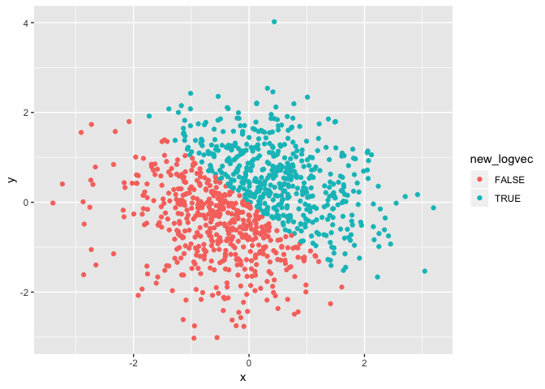
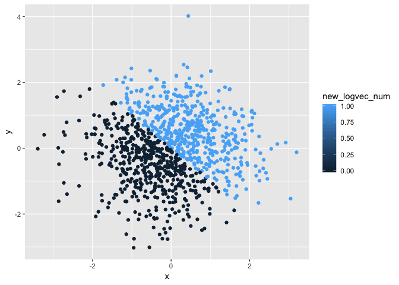
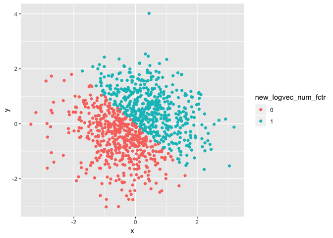

p8105\_hw1\_er2867.git
================
Elliot
September 21, 2018

``` r
library(tidyverse)
```

    ## ── Attaching packages ──────────────────────────── tidyverse 1.2.1 ──

    ## ✔ ggplot2 3.0.0     ✔ purrr   0.2.4
    ## ✔ tibble  1.4.2     ✔ dplyr   0.7.4
    ## ✔ tidyr   0.8.1     ✔ stringr 1.3.1
    ## ✔ readr   1.1.1     ✔ forcats 0.3.0

    ## ── Conflicts ─────────────────────────────── tidyverse_conflicts() ──
    ## ✖ dplyr::filter() masks stats::filter()
    ## ✖ dplyr::lag()    masks stats::lag()

``` r
##Problem 1
##A random sample of size 10 from a uniform[0, 5] distribution

prblm1 <-data.frame
  set.seed (504123)
  rndmsmpl=(rdunif(10, 5, 0))
  table(rndmsmpl)
```

    ## rndmsmpl
    ## 0 1 2 4 5 
    ## 1 3 2 2 2

``` r
  #A logical vector indicating whether elements of the sample are greater than 2
  
  grtr2 <- "logicalvec"  
  is.logical(grtr2)
```

    ## [1] FALSE

``` r
   as.logical (rndmsmpl > 2)
```

    ##  [1] FALSE FALSE FALSE FALSE FALSE  TRUE FALSE  TRUE  TRUE  TRUE

``` r
# A (length-10) character vector
 charvect <- "1,2,3,4,5,6,7,8,9,0"
 is.character(charvect)
```

    ## [1] TRUE

``` r
#A (length-10) factor vector
 factorvec <- factor(c("1,2,3,4,5,6,7,8,9,0"))
 factorvec
```

    ## [1] 1,2,3,4,5,6,7,8,9,0
    ## Levels: 1,2,3,4,5,6,7,8,9,0

``` r
 # Try to take the mean of each variable in your dataframe
  mean (rndmsmpl)
```

    ## [1] 2.5

``` r
  mean (grtr2)
```

    ## Warning in mean.default(grtr2): argument is not numeric or logical:
    ## returning NA

    ## [1] NA

``` r
  mean (charvect)
```

    ## Warning in mean.default(charvect): argument is not numeric or logical:
    ## returning NA

    ## [1] NA

``` r
  mean (factorvec)
```

    ## Warning in mean.default(factorvec): argument is not numeric or logical:
    ## returning NA

    ## [1] NA

``` r
#Only the mean of rndmsmpl can be taken, as it is the only numeric    #vector (see output)
```

``` r
#Write a code chunk that applies the as.numeric function to the        logical, character, and factor variables (please show this chunk   but not the output)
  
  grtr2num <-as.numeric (grtr2)
```

    ## Warning: NAs introduced by coercion

``` r
  charvectnum <-as.numeric (charvect) 
```

    ## Warning: NAs introduced by coercion

``` r
  factorvecnum <-as.numeric (factorvec)  

#convert your character variable from character to factor to numeric; similarly, convert your factor variable from factor to character to numeric. 
  charvec_factor <- as.factor(charvect)
  charvect_factornum <-as.numeric (charvec_factor) 
  
  factorvec_char <- as.character(charvect)
  factorvect_charnum <-as.numeric (factorvec_char)
```

    ## Warning: NAs introduced by coercion

``` r
  ##as a numeric variable, both the original charecter and factor variables take the value of 1
```

``` r
## Problem 2

#Code to clear the environment -
rm(list=ls())

prblm2 <-data.frame
#x: a random sample of size 1000 from a standard Normal distribution
  set.seed (1234)
  x <- rnorm(1000)

#y: a random sample of size 1000 from a standard Normal distribution
    set.seed (4321)
    y <- rnorm(1000)
       
#A logical vector indicating whether the x + y > 0
  new_logvec <- as.logical(x + y > 0)  
  
#A numeric vector created by coercing the above logical vector
 new_logvec_num <- as.numeric (new_logvec)
 
# A factor vector created by coercing the above logical vector
 new_logvec_num_fctr <-as.factor(new_logvec_num)

# size of dataset
  dataset1 <- data.frame(x,y, rep = TRUE)
  dim (dataset1) 
```

    ## [1] 1000    3

``` r
# the mean and median of x
  mean(x)
```

    ## [1] -0.0265972

``` r
  median (x)  
```

    ## [1] -0.03979419

``` r
# proportion of cases for which the logical vector is TRUE 
  table(new_logvec)
```

    ## new_logvec
    ## FALSE  TRUE 
    ##   499   501

``` r
#scatterplot of x and y  
  newdf <- data.frame(x,y,new_logvec)
  
  library (ggplot2)
  ggplot(data = newdf, aes(x=x,y=y, color=new_logvec)) +       geom_point()
```



``` r
# Second scatterplot - numeric
  newdf_num <- data.frame(x,y,new_logvec_num)
  
  library (ggplot2)
  ggplot(data = newdf, aes(x=x,y=y, color=new_logvec_num)) +       geom_point()
```



``` r
# Third scatterplot - factor
  newdf_fctr <- data.frame(x,y,new_logvec_num_fctr)
  
  library (ggplot2)
  ggplot(data = newdf, aes(x=x,y=y, color=new_logvec_num_fctr)) +       geom_point()
```



``` r
#Saving first scatterplot
 library (ggplot2)
  ggplot(data = newdf, aes(x=x,y=y, color=new_logvec)) +            geom_point()
```


``` r
  ggsave("p8105_hw1_er2867_plot.jpg")
```

    ## Saving 7 x 5 in image
